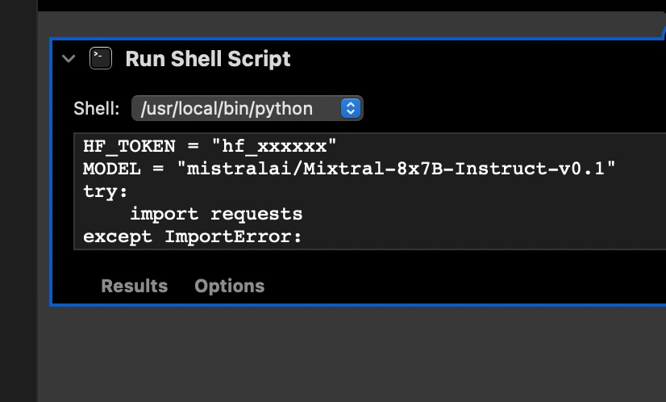
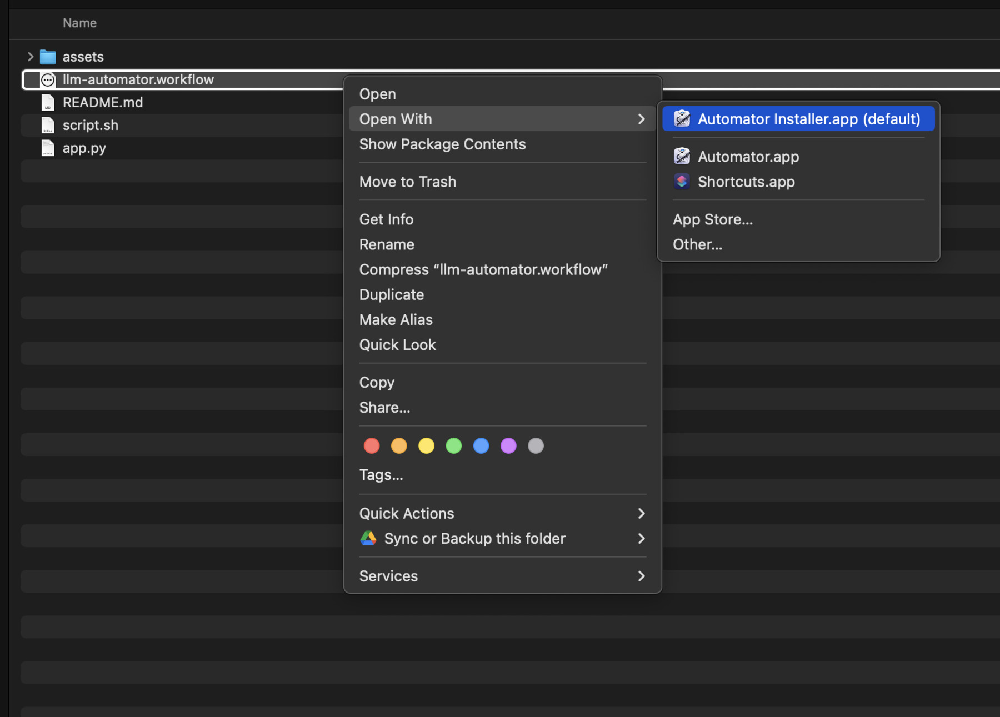
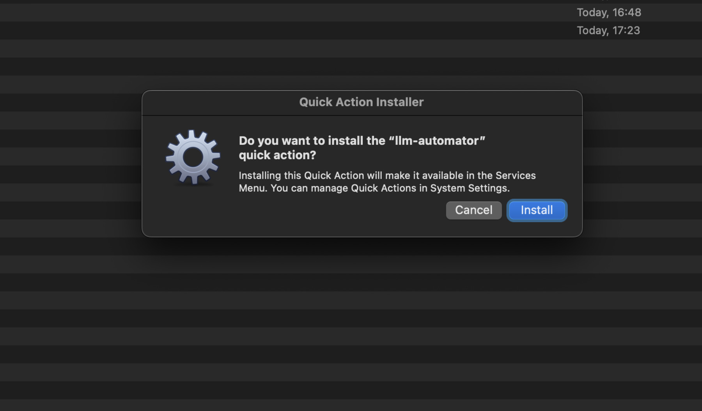
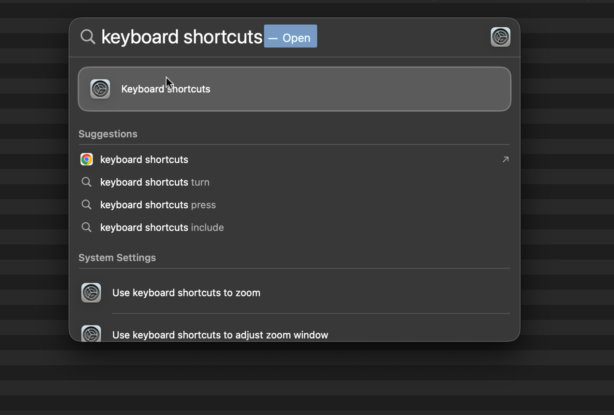
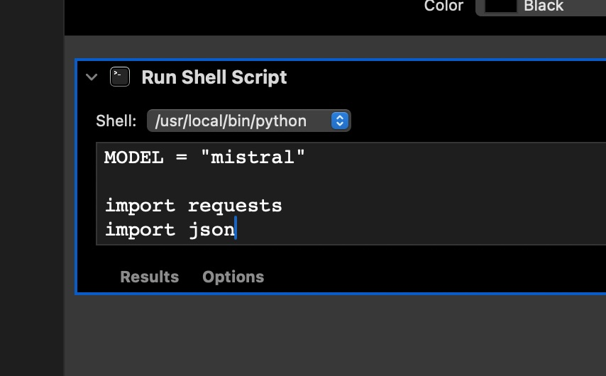

# LLM-automator

## Guides
[Huggingface-Backend](#huggingface-backend)  
[Ollama](#ollama-backend)  
[OpenAI](#openai)  

For a multi-platform solution, consider [plock project](https://github.com/jasonjmcghee/plock)

# Huggingface Backend

## Installation

Get `HF_TOKEN` from <https://huggingface.co/settings/tokens>

Edit `llm-automator.workflow` with the Automator app, replace `HF_TOKEN` with your token.

You may also edit `MODEL="mistralai/Mixtral-8x7B-Instruct-v0.1"` to use a different LLM from [huggingface.co/models](https://huggingface.co/models?pipeline_tag=text-generation&other=endpoints_compatible&sort=trending)




Install the workflow. This essentially copies the workflow to `~/Library/Services/llm-automator.workflow`.





Go to System Preferences -> Keyboard -> Shortcuts -> Services -> General -> llm-automator, and set the shortcut to whatever you want, in my case I set it to `⌃⌥⌘M`.




## Usage

In any OSX application, select some text, and press the shortcut you set in step 3. The selected text will be replaced with the generated text from the model.

# Ollama Backend

Install [ollama](https://ollama.ai/)

Run in the background:

```bash
ollama run mistral
```

Install `llm-automator-ollama.workflow` the same way as above, no need to edit and add token, however you may edit `MODEL="mistral"`, in case you want to use a different model




## Vision


https://github.com/radames/LLM-automator/assets/102277/d3336837-2b3d-471d-8c04-47e572cec411


# OpenAI


Install `llm-automator-openai.workflow` the same way as above, however you may edit `OPENAI_KEY = "sk-.........."` and `MODEL = "gpt-4-1106-preview"`, in case you want to use a different model


----
https://github.com/radames/LLM-automator/assets/102277/5144a46d-7b3c-443e-a86e-c0b8205085f1


